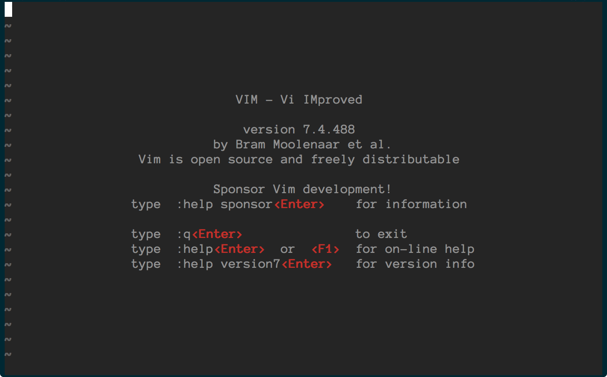
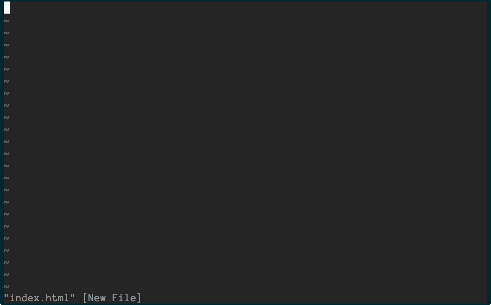
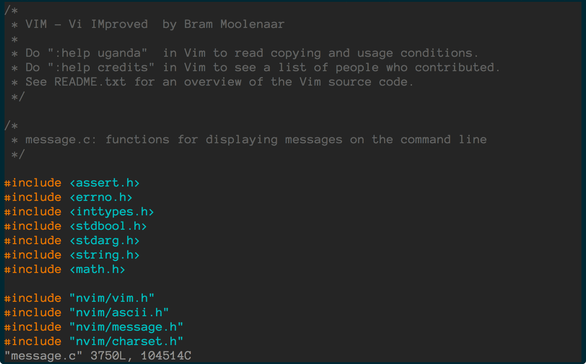
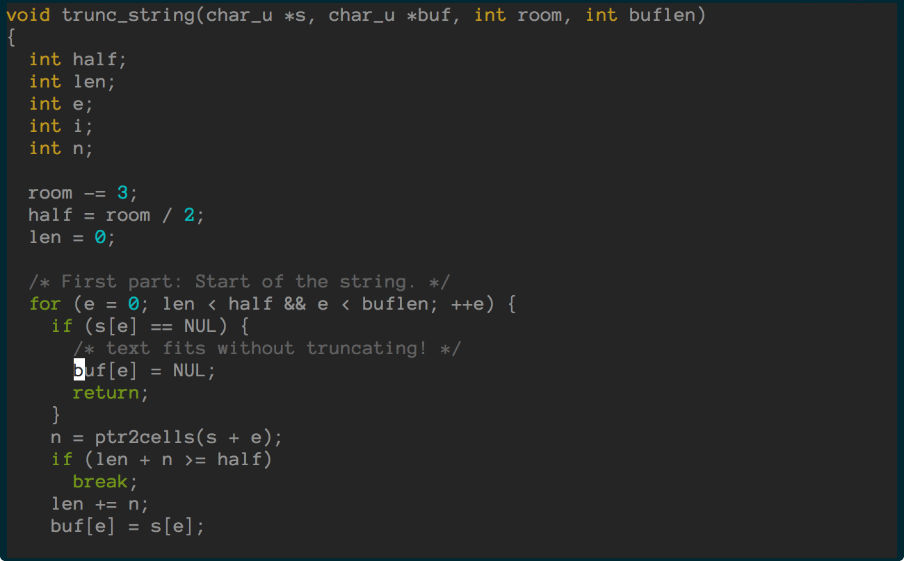

# vim gifs

I made some animated gifs from my favorite vim plugins.

# The gifs

## ctrlp.vim

`ctrlpvim/ctrlp.vim`



## emmet-vim

`mattn/emmet-vim`



## vim-commentary

`tpope/vim-commentary`



## vim-move

`matze/vim-move`



# How to create vim animated gifs

Create `essential.vim`, which only contains the bare minimum you need for the gif. In my case this is:

```
set nocompatible
filetype plugin on

filetype off

set rtp+=~/.vim/bundle/Vundle.vim
call vundle#rc()
Plugin 'gmarik/Vundle.vim'

Plugin 'ctrlpvim/ctrlp.vim'

filetype plugin indent on

syntax on
set background=dark
let g:solarized_termcolors=256
colorscheme solarized
set tabstop=2 softtabstop=2 shiftwidth=2 expandtab
let mapleader = ","
```

But instead of `Plugin 'ctrlpvim/ctrlp.vim’`, put whatever plugin you want to show.

Then run `:PluginClean` and `:PluginInstall`

Then set an alias to easily open vim with this configuration.

```
alias vi='vim -u ~/.vim/essential.vim'
```

Open a new iTerm 2 window so that it will open at the exact right size that you have set in your iTerm 2 Preferences under Profiles -> Window. I have it set to 80 columns and 25 rows, which is the default.

## Record with ttygif

[ttygif](https://github.com/icholy/ttygif) is a program that lets you create animated gifs from the terminal. Make sure you have it installed and then record a session:

```
ttyrec myrecording
```

Open vim, record your keystrokes, and then when your done, quit vim and run:

```
exit
```

Then turn your session into a series of images by running (`-f` makes sure that it doesn't crop anything):

```
ttygif -f myrecording
```

Delete then unnecessary frames, such as at the beginning and the end. Then you can convert it to an animated gif with ttygif

```
# on OSX, use concat_osx.sh instead
./concat.sh terminal.gif
```

or with ImageMagick:

```
convert -delay 20 *.png animated.gif
```

## Crop the gif

This would look pretty great with the status bar, but it keeps flashing `ttyrec` and `screencapture`, so I decided to crop it out.

You can use [ezgif.com](http://ezgif.com/) to crop the gifs online.

Crop to this size:

X1- 0

Y1- 44

W- 1300

H- 808
