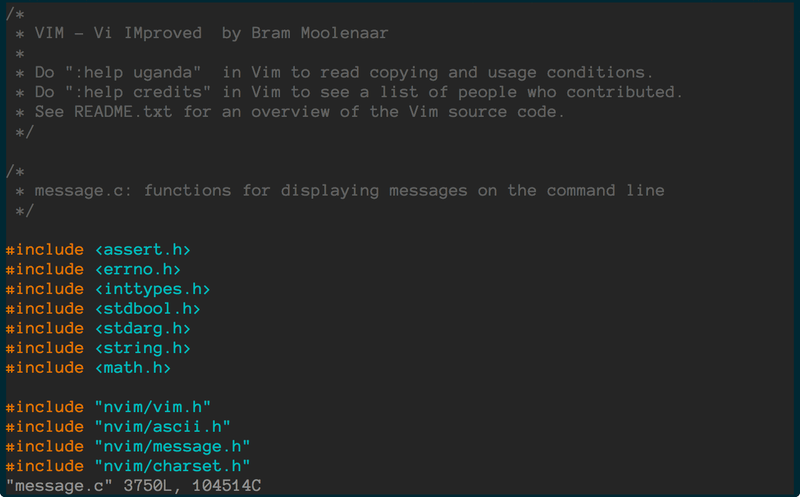
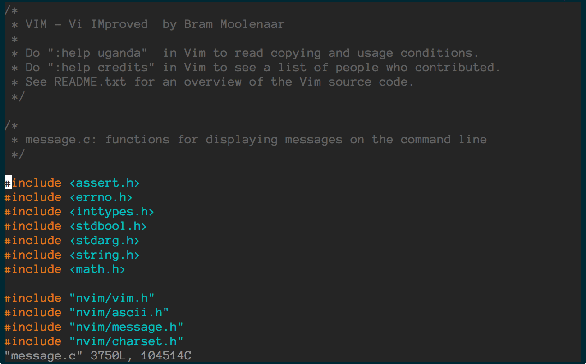
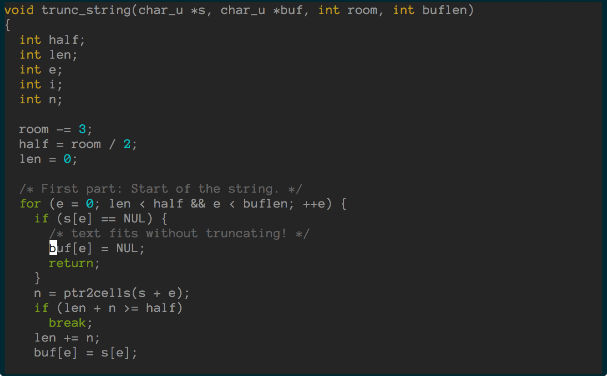
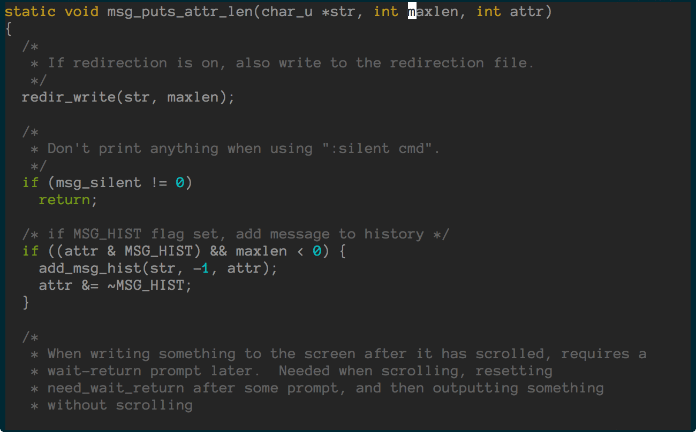
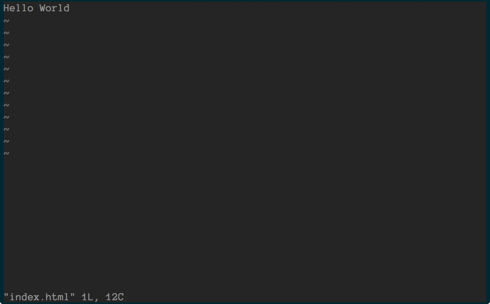

# vim gifs

I made some animated gifs from my favorite vim plugins.

[How to Create Vim Animated Gifs](http://www.adamwadeharris.com/how-to-create-vim-animated-gif/)

# The gifs

## [ctrlp.vim](ctrlpvim/ctrlp.vim)

## [emmet-vim](mattn/emmet-vim)

## [vim-commentary](tpope/vim-commentary)

## [vim-gitgutter](airblade/vim-gitgutter)

## [vim-move](matze/vim-move)

## [vim-multiple-cursors](https://github.com/terryma/vim-multiple-cursors)

## [vim-surround](https://github.com/tpope/vim-surround)

## License

To the extent possible under law, Adam Harris has waived all copyright and related or neighboring rights to this work.
